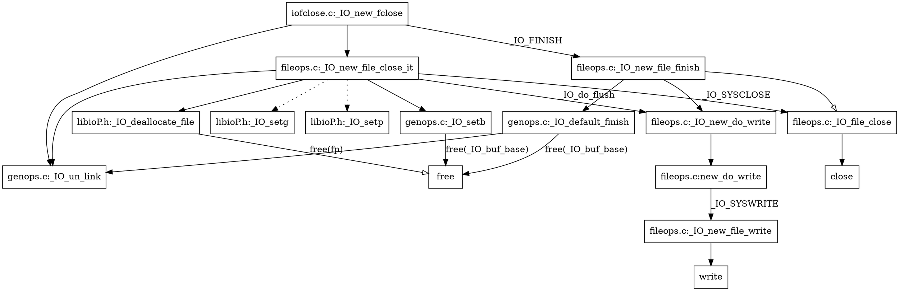

```graphviz
digraph fclose_call_graph {
    node [shape="box"];

    fclose -> _IO_un_link;
    fclose -> _IO_new_file_close_it;
        _IO_new_file_close_it -> _IO_do_flush[label="_IO_do_flush"];
            _IO_do_flush -> new_do_write;
                new_do_write -> _IO_SYSWRITE[label="_IO_SYSWRITE"];
                    _IO_SYSWRITE -> write;

        _IO_new_file_close_it -> _IO_file_close[label="_IO_SYSCLOSE"];
            _IO_file_close -> close;
        
        _IO_new_file_close_it -> _IO_setb;
             _IO_setb -> free[label="free(_IO_buf_base)"]

        _IO_new_file_close_it -> _IO_setg[style="dotted"];

        _IO_new_file_close_it -> _IO_setp[style="dotted"];

        _IO_new_file_close_it -> _IO_un_link;

        _IO_new_file_close_it -> _IO_deallocate_file;
            _IO_deallocate_file -> free[label="free(fp)", arrowhead="onormal"];

    fclose -> _IO_FINISH[label="_IO_FINISH"];
        _IO_FINISH -> _IO_do_flush;
        _IO_FINISH -> _IO_file_close[arrowhead="onormal"];
        _IO_FINISH -> _IO_default_finish;
            _IO_default_finish -> free[label="free(_IO_buf_base)"];
            _IO_default_finish -> _IO_un_link;

    fclose [label="iofclose.c:_IO_new_fclose"];
    _IO_un_link [label="genops.c:_IO_un_link"];
    _IO_new_file_close_it [label="fileops.c:_IO_new_file_close_it"];
    new_do_write[label="fileops.c:new_do_write"];
    _IO_SYSWRITE[label="fileops.c:_IO_new_file_write"];
    _IO_do_flush [label="fileops.c:_IO_new_do_write"];
    _IO_file_close [label="fileops.c:_IO_file_close"];
    _IO_FINISH[label="fileops.c:_IO_new_file_finish"];
    _IO_deallocate_file[label="libioP.h:_IO_deallocate_file"];
    _IO_setb[label="genops.c:_IO_setb"];
    _IO_setg[label="libioP.h:_IO_setg"];
    _IO_setp[label="libioP.h:_IO_setp"];
    _IO_default_finish[label="genops.c:_IO_default_finish"];
}
```