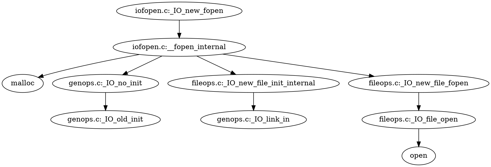

```graphviz
digraph fread_call_graph {

    fopen -> __fopen_internal;
        __fopen_internal -> malloc;
        __fopen_internal -> _IO_no_init;
            _IO_no_init -> _IO_old_init;

        __fopen_internal -> _IO_new_file_init_internal;
            _IO_new_file_init_internal -> _IO_link_in;

        __fopen_internal -> _IO_file_fopen;
            _IO_file_fopen -> _IO_file_open;
                _IO_file_open -> open;


    fopen[label="iofopen.c:_IO_new_fopen"];
    __fopen_internal[label="iofopen.c:__fopen_internal"];
    _IO_no_init[label="genops.c:_IO_no_init"];
    _IO_old_init[label="genops.c:_IO_old_init"];
    _IO_new_file_init_internal[label="fileops.c:_IO_new_file_init_internal"];
    _IO_link_in[label="genops.c:_IO_link_in"];
    _IO_file_fopen[label="fileops.c:_IO_new_file_fopen"];
    _IO_file_open[label="fileops.c:_IO_file_open"];
}
```