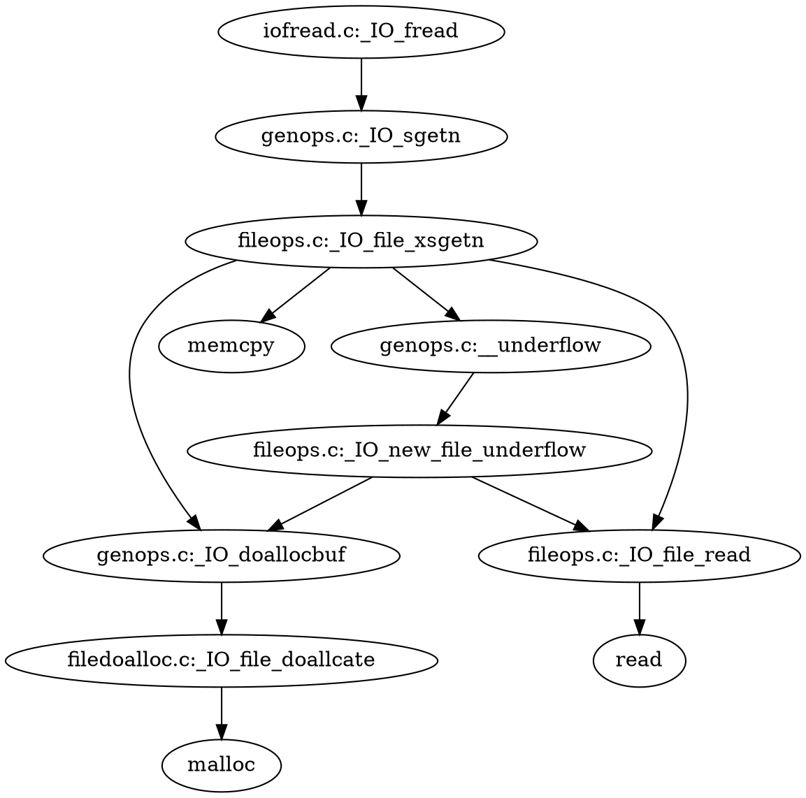

```graphviz
digraph fread_call_graph {

    fread -> _IO_sgetn;
        _IO_sgetn -> _IO_XSGETN;
            _IO_XSGETN -> _IO_doallocbuf;
                _IO_doallocbuf -> _IO_DOALLOCATE;
                    _IO_DOALLOCATE -> malloc;
            
            _IO_XSGETN -> memcpy;
            _IO_XSGETN -> __underflow;
                __underflow -> _IO_UNDERFLOW;
                    _IO_UNDERFLOW -> _IO_doallocbuf;
                    _IO_UNDERFLOW -> _IO_SYSREAD;
                        _IO_SYSREAD -> read;
            _IO_XSGETN -> _IO_SYSREAD;
            

    fread [label="iofread.c:_IO_fread"];
    _IO_sgetn [label="genops.c:_IO_sgetn"];
    _IO_XSGETN [label="fileops.c:_IO_file_xsgetn"];
    _IO_doallocbuf [label="genops.c:_IO_doallocbuf"];
    _IO_DOALLOCATE [label="filedoalloc.c:_IO_file_doallcate"];
    __underflow [label="genops.c:__underflow"];
    _IO_UNDERFLOW [label="fileops.c:_IO_new_file_underflow"];
    _IO_SYSREAD [label="fileops.c:_IO_file_read"];
}
```