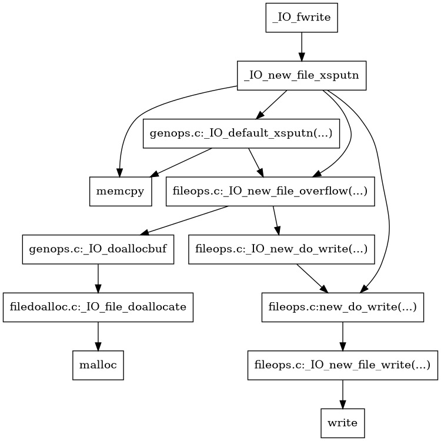

```graphviz
digraph fwrite_call_graph {
    rankdir=TD;
    size="8,5"
    node[shape="box"]

    fwrite -> _IO_xputn;
        _IO_xputn -> memcpy;
        _IO_xputn -> _IO_OVERFLOW;
            _IO_OVERFLOW -> _IO_doallocbuf;
                _IO_doallocbuf -> _IO_DOALLOCATE;
                    _IO_DOALLOCATE -> malloc;
            _IO_OVERFLOW -> _IO_new_do_write;
                _IO_new_do_write -> new_do_write;
        _IO_xputn -> new_do_write;
            new_do_write -> _IO_SYSWRITE;
                _IO_SYSWRITE -> write;
        _IO_xputn -> _IO_default_xsputn;
            _IO_default_xsputn -> memcpy;
            _IO_default_xsputn -> _IO_OVERFLOW;
    

    fwrite [label="_IO_fwrite"];
    _IO_xputn [label="_IO_new_file_xsputn"];
    _IO_OVERFLOW [label="fileops.c:_IO_new_file_overflow(...)"];
    new_do_write [label="fileops.c:new_do_write(...)"];
    _IO_SYSWRITE [label="fileops.c:_IO_new_file_write(...)"];
    _IO_default_xsputn [label = "genops.c:_IO_default_xsputn(...)"];
    _IO_doallocbuf [label = "genops.c:_IO_doallocbuf"];
    _IO_DOALLOCATE [label = "filedoalloc.c:_IO_file_doallocate"];
    _IO_new_do_write [label = "fileops.c:_IO_new_do_write(...)"];

}
```