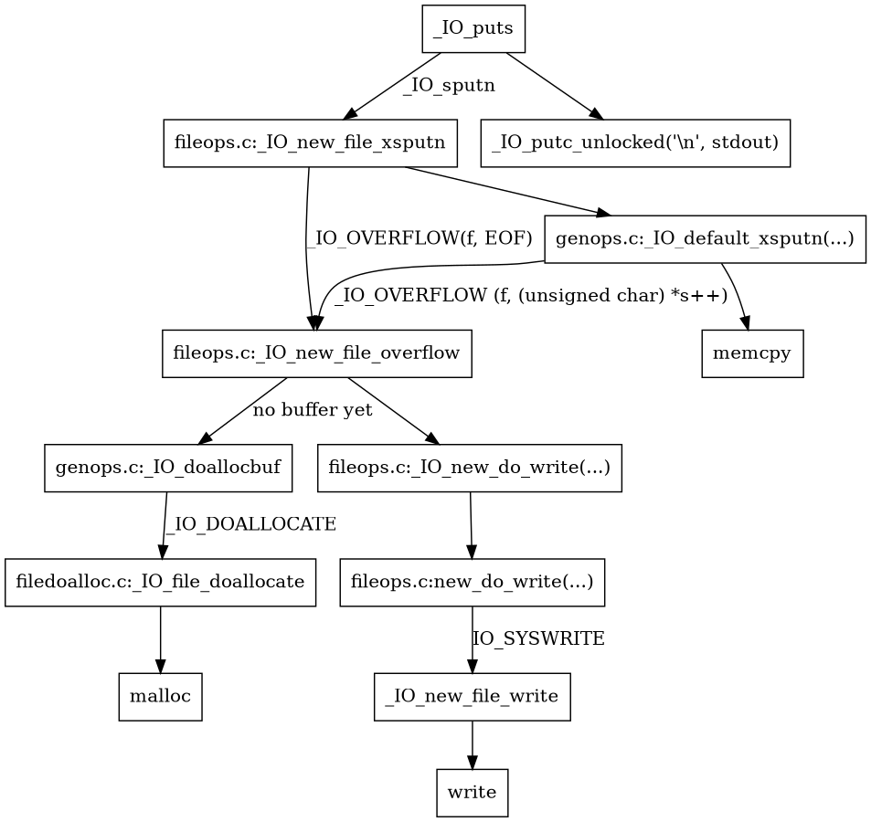

```graphviz
digraph puts_call_graph {
    rankdir=TD;
    size="8,6"
    node[shape="box"]

    _IO_puts -> _IO_sputn[label="_IO_sputn"];
        _IO_sputn -> _IO_OVERFLOW[label="_IO_OVERFLOW(f, EOF)"];
            _IO_OVERFLOW -> _IO_doallocbuf[label="no buffer yet"];
                _IO_doallocbuf -> _IO_DOALLOCATE[label="_IO_DOALLOCATE"];
                    _IO_DOALLOCATE -> malloc;

            _IO_OVERFLOW -> _IO_new_do_write;
                _IO_new_do_write -> new_do_write;
                    new_do_write -> _IO_SYSWRITE[label="IO_SYSWRITE"];
                        _IO_SYSWRITE -> write;
                        
        _IO_sputn -> _IO_default_xsputn;
            _IO_default_xsputn -> memcpy;
            _IO_default_xsputn -> _IO_OVERFLOW[label="_IO_OVERFLOW (f, (unsigned char) *s++)"];

    _IO_puts -> _IO_putc_unlocked;

    _IO_sputn [label = "fileops.c:_IO_new_file_xsputn"];
    _IO_putc_unlocked [label = "_IO_putc_unlocked('\\n', stdout)"];
    _IO_OVERFLOW [label = "fileops.c:_IO_new_file_overflow"];
    new_do_write [label= "fileops.c:new_do_write(...)"];
    _IO_doallocbuf [label = "genops.c:_IO_doallocbuf"];
    _IO_DOALLOCATE [label = "filedoalloc.c:_IO_file_doallocate"];
    _IO_new_do_write [label = "fileops.c:_IO_new_do_write(...)"];
    _IO_default_xsputn [label = "genops.c:_IO_default_xsputn(...)"];
    _IO_SYSWRITE [label = "_IO_new_file_write"];
}
```